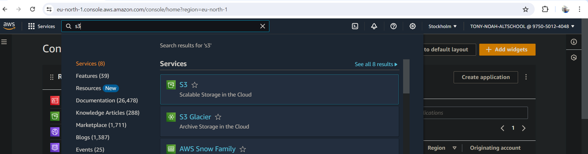

# Host a static webpage on a private aws s3 bucket and access its content using cloudfront

## But, you might be wondering what is CloudFront and what is its usefullness. According to Amazon Web Service `Amazon CloudFront speeds up distribution of your static and dynamic web content, such as .html, .css, .php, image, and media files. When users request your content, CloudFront delivers it through a worldwide network of edge locations that provide low latency and high performance.`

## You might also be wondering `"how possible is it to access the objects since the bucket is private",` well let me show you how that can be done.

### Requirements
1. Aws account with a user that has an IAM user privileges like the s3fullAccess policy, cloudfrontFullAccess policy and IAMAccessAnalyzerFullAccess policy

### STEPS TO FOLLOW

1. `Sign-in to your aws account, then search for S3 in the search box, click on s3 and click on create bucket as you can see in the images below, input your bucket name, note that your bucket name has to be unique, then leave every other settings as the default, scroll down and click on CREATE bucket`

2. `We would now upload objects into our just created bucket, we would click on the bucket and open it, then click on upload, then we click on upload, it will give us option to upload files and upload folder, we would select upload folder since our objects resides in a folder after we must have uploaded everything successfully, we would now move to the next step`

3. `we would be moving the content of the file inside of our folder to the bucket root directory, so we would click on the folder, after it is open, we would select all the objects, then click on action and click on move, then it will open a page, then under the destination tab click on browse s3, it will open another page, just click on the name of your bucket, then click on choose destination, it will open another page, scroll down, then click on move, you have now successfully moved all the objects in to the bucket root directory`

4. `Next step is to create our cloudfront, so you will go to your search box and type cloudfront, click on it, then once it is opened click on create distribution`

5. `Now fill up the informations by clicking on the Origin domain name annd select your bucket name, if you have multiple s3 bucket, it will list all, all you need is just to select the particular s3 bucket you want to connect with cloudfront, then scroll down and under the origin access, select origin access control settings, then scroll down and click on create new OAC, leave evrything as default then on create. Then scroll down, look for default root object and input your landing page, for us our landing page is index.html, though it is optional, you can either leave it blank. But note that once you leave it blank, when you are trying to access the domain name that cloudfront would assign to you bucket, you will need to use "/index.html" to access your index page, so click on create`

6. `Next is to copy the bucket policy that was generated and go back to your s3 bucket, and under the permission tab, scroll down till you see bucket policy, edit it and paste the copied policy there , then save`

7. `The next step is to go back to our cloudfront, click on the distribution we created and you will see domain name that was assigned to our bucket, copy that domain name and paste in your browser to see if it is working, note that it might take some minutes before it start working for the first time`

8. `We can now see that our domain name has now successfully rendered our landing page`

So, this is how to host a static webpage on a private bucket and still be able to access it using CloudFront.